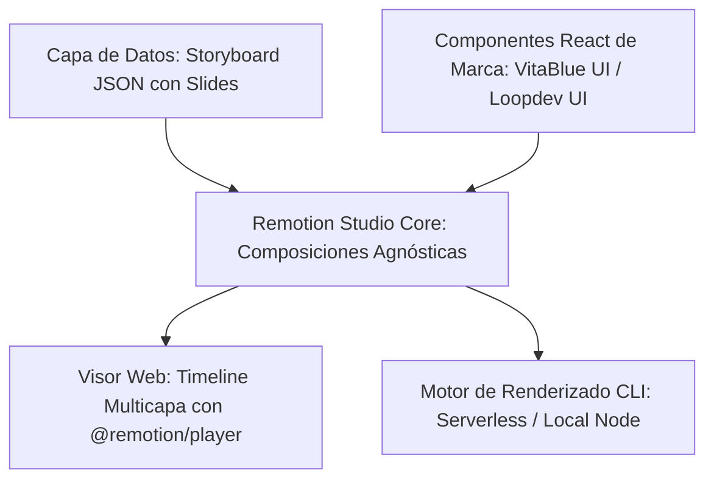

# Conductor Track: Agnostic Video Studio Integration (Remotion Engine)

Este documento detalla la arquitectura, el diseño del sistema y los pasos de implementación para integrar un generador de vídeo programático basado en **Remotion** dentro de VitaBlue, estructurado de manera agnóstica para permitir su migración inmediata a **Loopdev** o cualquier otra plataforma de manera transparente.

---

## 🎯 Arquitectura del Generador Agnóstico (Modelo Storyboard con Timeline Web Multicapa)

Para garantizar que el motor de renderizado de vídeo sea **100% independiente** del framework anfitrión (VitaBlue v2) y funcione tanto en el entorno de desarrollo local como en el servidor de producción (`www.vitablue.es`), el sistema adopta un modelo de edición secuencial por **diapositivas ("slides")** e integra un **entorno de previsualización propio (Custom Preview Studio)** en la web:

1. **Capa de Datos Estructurada (Agnóstica):** El video se compone de diapositivas (`slides`) con duraciones individuales en frames y variables de contenido (JSON).
2. **Capa Visual (Aislada):** Componentes React puros que heredan los tokens de marca del proyecto web.
3. **Capa de Visualización y Edición Web (Custom Preview):** Un editor web interactivo inspirado en Remotion Preview Studio que no depende de Node ni de comandos locales. Se implementa en producción usando la biblioteca `@remotion/player` para renderizar el timeline interactivo directamente en el navegador del cliente.
4. **Capa de Exportación (Motor):** Renderizado local por CLI o pipeline Serverless (AWS Lambda / Supabase Edge Functions con Docker) para compilar y descargar el MP4 de forma asíncrona.

---

## 🛠️ Plan de Implementación Paso a Paso

### Fase 1: Creación del Paquete de Video Aislado
Crearemos un directorio de trabajo independiente `/packages/video-studio` o `/video-engine` dentro del proyecto. Esto nos permitirá mantener todas las dependencias y scripts de renderizado de vídeo aislados del bundle principal de producción de la web corporativa.

* **Paso 1.1:** Inicializar la configuración de Remotion y Puppeteer en un entorno desacoplado.
* **Paso 1.2:** Crear un archivo de configuración base `remotion.config.ts` optimizado para renderizados rápidos a resolución vertical (1080x1920, 30fps).
* **Paso 1.3:** Configurar alias de TypeScript para poder inyectar componentes desde la aplicación anfitriona hacia Remotion.

### Fase 2: Componentización y Adaptadores de UI
Para que los componentes de VitaBlue se puedan renderizar en el vídeo, deben recibir parámetros puros (props).

* **Paso 2.1:** Diseñar las composiciones principales de vídeo utilizando las APIs de Remotion (`useCurrentFrame`, `useVideoConfig`, `spring`, `interpolate`).
* **Paso 2.2:** Crear un renderizador dinámico de diapositivas que decida qué componente de VitaBlue (`RequirementsComparisonTable`, `AdvisorCard`, etc.) mostrar en función del frame de tiempo activo en la línea de tiempo global.

### Fase 3: Custom Preview Studio en el Backoffice (Timeline Editor)
Implementaremos en el cliente web una interfaz de usuario interactiva premium inspirada en editores profesionales de video:

* **Paso 3.1:** Integrar `@remotion/player` con controles externos de reproducción (Play, Pausa, Restart).
* **Paso 3.2:** Construir la **Línea de Tiempo Multicapa (Horizontal Timeline):**
  * Eje temporal con reglas de segundo a segundo.
  * Pistas de visualización horizontales (rectángulos representando las diapositivas).
  * Cursor o cabezal de reproducción vertical que se mueva en vivo sincronizado con el frame activo del reproductor.
  * Soporte para "hacer click y arrastrar" (scrubbing) sobre el timeline para avanzar/retroceder en el video.
* **Paso 3.3:** Diseñar los formularios de inyección de datos dinámicos para los componentes de marca de cada escena.

### Fase 4: Servidor de Renderizado y Exportación (Pipeline)
Para exportar a MP4, Remotion requiere Node y un navegador Chromium (a través de Puppeteer).

* **Paso 4.1:** Escribir un script local `npm run render-video` que invoque el compilador CLI de Remotion (`npx remotion render`).
* **Paso 4.2:** Diseñar el flujo Serverless opcional: una función en la nube (ej. AWS Lambda o Supabase Edge Functions con Docker) para que cuando se use la herramienta en producción web, el procesamiento del archivo MP4 se haga en la nube sin ralentizar la experiencia del usuario.

---

## 🔄 Guía de Migración a Loopdev (U otras plataformas)

Para mover esta herramienta a Loopdev sin cambiar una sola línea del motor de animación, solo necesitas seguir estos pasos:

1. **Copiar la carpeta del motor:** Duplicar la carpeta `/packages/video-studio` en la raíz del nuevo proyecto.
2. **Reemplazar el archivo de componentes de marca (UI Adapter):** Cambiar los componentes importados de VitaBlue por los de Loopdev. El motor de Remotion y la línea de tiempo seguirán funcionando exactamente igual siempre que las propiedades de entrada (JSON) mantengan la misma estructura.
3. **Instalar dependencias de Remotion:** Ejecutar `npm install remotion @remotion/player @remotion/cli` en el proyecto de destino.
4. **Actualizar tokens de diseño:** Las animaciones y estilos de Remotion leen las clases de Tailwind del proyecto anfitrión. Si en Loopdev cambias los colores primarios y fuentes de Tailwind, los videos de Remotion adoptarán automáticamente la nueva identidad corporativa.
Remotion adoptarán automáticamente la nueva identidad corporativa.
